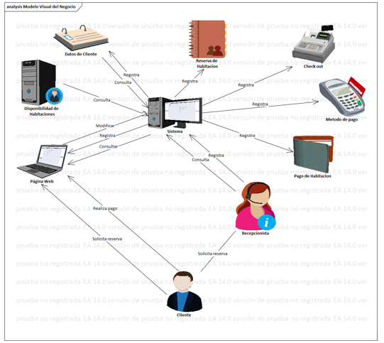
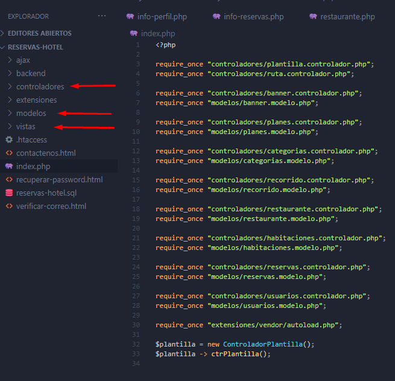
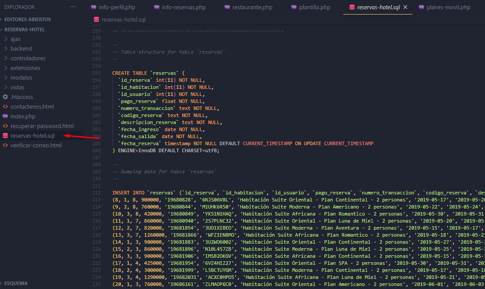
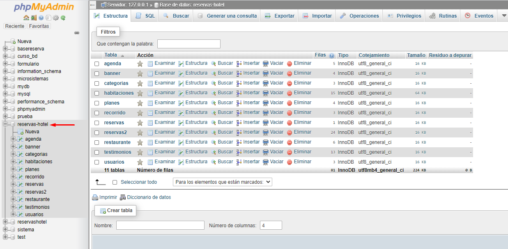
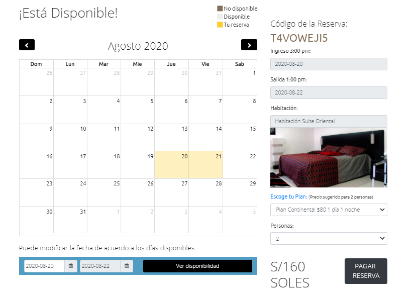
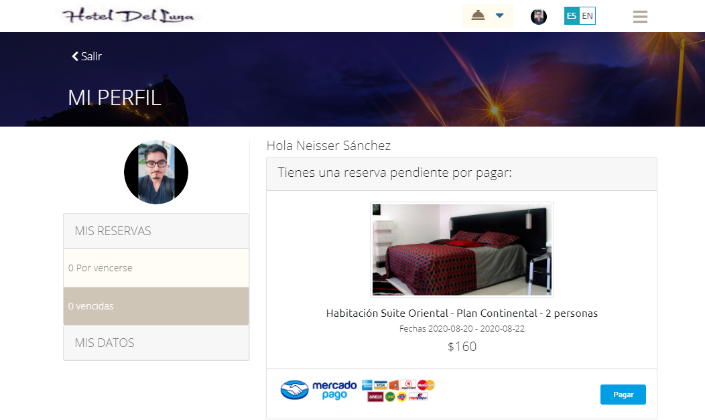
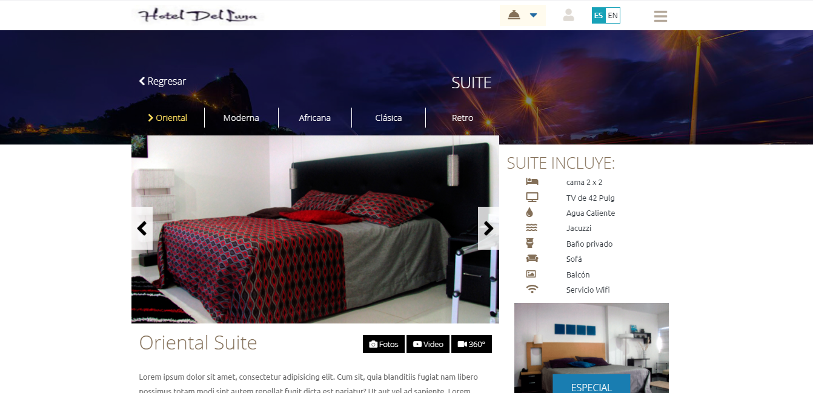

# Website Reservations for a Hotel

This project is built with HTML, CSS, JAVA SCRIPT and PHP technologies. In addition, the MVC Pattern has been applied to separate the application development into layers.
In addition to having migrated to PHP, the pages of the site have been modularized since there are several parts that are repeated.


In order for the pages to do the corresponding thing when browsing the site, the **GET** variables have been used, which allow us to send through the URL, that is, we indicate that it shows us what we need.


```

	if($_GET["pagina"] == "reservas" || $_GET["pagina"] == "perfil" || $_GET["pagina"] == "salir"){

		include "paginas/".$_GET["pagina"].".php";
		
	}else if($validarRuta != ""){

		include "paginas/habitaciones.php";

	}else{

		echo '<script>

		window.location = "'.$ruta.'";

		</script>';
	}

}else{

	include "paginas/inicio.php";

}

```

And for the forms, the **POST** variables were used since the information is sent in an invisible way.

```
<form method="post">
```


and the next thing was to convert those GET variables to a friendly URL and it was made possible by **.htaccess**

```
Options All -Indexes

RewriteEngine On
RewriteRule ^([-a-zA-Z0-9/]+)$ index.php?pagina=$1
```
And then to make the data dynamic we have created the database in MySQL to bring the information from there through **SQL statements (queries).**

```
	static public function mdlMostrarHabitacion($tabla, $valor){
		$stmt = Conexion::conectar()->prepare("SELECT * FROM $tabla WHERE id_h = :id_h");

		$stmt -> bindParam(":id_h", $valor, PDO::PARAM_INT);

		$stmt -> execute();

		return $stmt -> fetch();

		$stmt -> close();

		$stmt = null;
	}
}
```
### Some performance tests performed

* Crossing dates
* You cannot register with the same email
* They cannot enter your profile without first registering
* They cannot breach sensitive folders from the URL
* Simulate reservation payment with Mercado Pago

#### Business model


### MVC
 

### Código BD
 

### MySQL
 

### Some Website Screens





> The project was not made by me, I bought it for a university course and thanks to it I have learned a lot along the way, I will share them if it helps.

